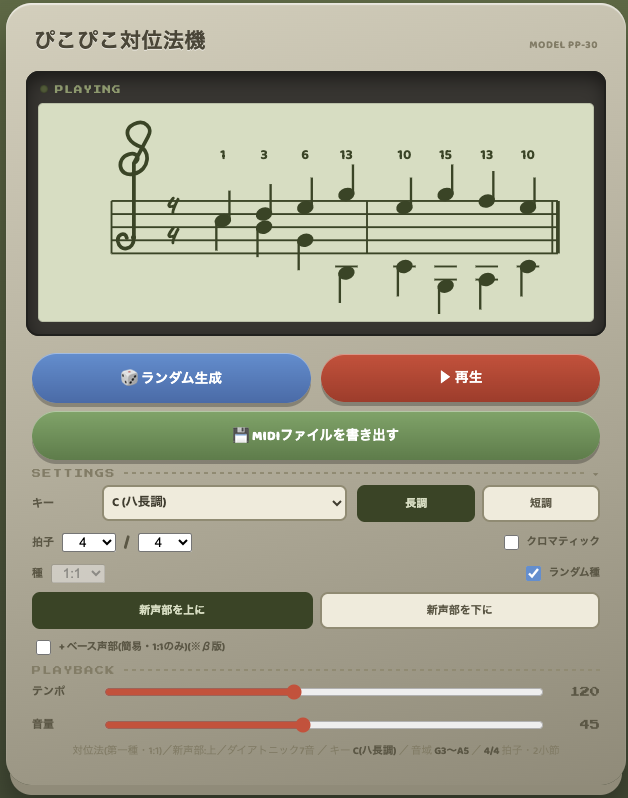

[README.md](https://github.com/user-attachments/files/29437548/README.md)
# ぴこぴこ対位法機

ファミコン風(NESチップチューン)の音色で動く、対位法の自動生成・学習ツールです。サーバー不要、単一HTMLファイルをブラウザで開くだけで動作します。

🎮 **[ここで実際に試せます](https://frspishigami.github.io/pikopiko-taiihou/)**

## 主な機能

- **対位法の種**: 1:1(第一種)・2:1・4:1(第二・三種、経過音つき)・4種(掛留/シンコペーション)。ランダムまたは手動選択
- **キー**: 12長調+12短調(ハーモニックマイナー)。増2度・三全音・7度の禁則跳躍を自動回避
- **ベース声部**(β版): 3声同時の対位法を簡易表示
- **音域・拍子**: 自由に設定可能。16分音符が出る箇所は譜面を自動で2段分割
- **再生・書き出し**: ファミコン風パルス波/三角波で再生、MIDIファイルとして書き出し可能
- **手書き風記譜**: 拍子記号などに手書き風のフォントを使用したカジュアルな見た目

## 使い方

1. キー・音域・拍子・種などを設定
2. 「ランダム生成」で対旋律(+必要な声部)を自動生成
3. 「再生」で確認、「MIDIファイルを書き出す」でDAWに取り込み

## 技術的なメモ

- 依存ライブラリなし(ピュアJS + SVG + Web Audio API)
- フォントはGoogle Fonts(Press Start 2P / Baloo 2 / Caveat)をCDN経由で読み込み
- MIDI書き出しは自前のSMFライターを実装

## ライセンス

MIT License. 詳細は [LICENSE](./LICENSE) を参照してください。

## 支援

このツールが気に入ったら、[Amazonほしい物リスト](https://www.amazon.jp/hz/wishlist/ls/T5W4R43FK25P?ref_=wl_share) からの支援も歓迎しています。
